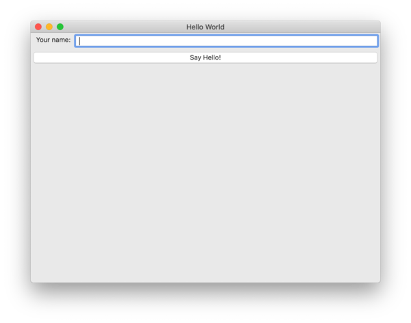
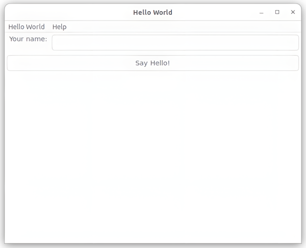
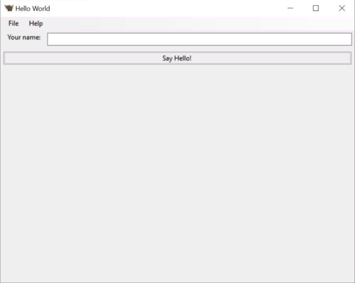

# Tutorial 2 - Making it interesting

In [Tutorial 1](tutorial-1.md), we generated
a stub project that was able to run, but we didn't write any code
ourselves. Let's take a look at what was generated for us.

## What was generated

In the `src/helloworld` directory, you should see 3 files:
`__init__.py`, `__main__.py` and `app.py`.

`__init__.py` marks the `helloworld` directory as an importable Python
module. It is an empty file; the very fact it exists tells the Python
interpreter that the `helloworld` directory defines a module.

`__main__.py` marks the `helloworld` module as a special kind of module
-an executable module. If you try to run the `helloworld` module using
`python -m helloworld`, the `__main__.py` file is where Python will
start executing. The contents of `__main__.py` is relatively simple:

```python
from helloworld.app import main

if __name__ == "__main__":
    main().main_loop()
```

This file does two things:

- It imports the `main` method from the `helloworld` app.
- Then, it starts the application’s main loop. The main loop is the way
  a GUI application listens for user input (like mouse clicks and
  keyboard presses).

The more interesting file is `app.py` - this contains the logic that
creates our application window:

```python
import toga
from toga.style.pack import COLUMN, ROW

class HelloWorld(toga.App):
    def startup(self):
        main_box = toga.Box()

        self.main_window = toga.MainWindow(title=self.formal_name)
        self.main_window.content = main_box
        self.main_window.show()

def main():
    return HelloWorld()
```

Let's go through this line by line:

```python
import toga
from toga.style.pack import COLUMN, ROW
```

First, we import the `toga` widget toolkit, as well as some
style-related utility constants. Our code doesn't use these yet - but
we'll make use of them shortly.

Then, we define a class:

```python
class HelloWorld(toga.App):
```

Each Toga application has a single `toga.App` instance, representing the
running entity that is the application. The app may end up managing
multiple windows; but for simple applications, there will be a single
main window.

Next, we define a `startup()` method:

```python
def startup(self):
    main_box = toga.Box()
```

The first thing the startup method does is to define a main box. Toga's
layout scheme behaves similar to HTML. You build an application by
constructing a collection of boxes, each of which contains other boxes,
or actual widgets. You then apply styles to these boxes to define how
they will consume the available window space.

In this application, we define a single box, but we don't put anything
into it.

Next, we define a window into which we can put this empty box:

```python
self.main_window = toga.MainWindow(title=self.formal_name)
```

This creates an instance of a `toga.MainWindow`, which will have a title
matching the application's name. A Main Window is a special kind of
window in Toga - it's a window that is closely bound to the life cycle
of the app. When the Main Window is closed, the application exits. The
Main Window is also the window that has the application's menu (if
you're on a platform like Windows where menu bars are part of the
window).

/// admonition | Where is my window?

If you have made an error in your code, the main window of the app may
not display. If this happens, you can type **Ctrl+C** in the terminal
where you started the app. This will stop the app. You can then fix the
error and restart the app.

///

We then add our empty box as the content of the main window, and
instruct the application to show our window:

```python
self.main_window.content = main_box
self.main_window.show()
```

Last of all, we define a `main()` function. This is what creates the
instance of our application:

```python
def main():
    return HelloWorld()
```

This `main()` method is the one that is imported and invoked by
`__main__.py`. It creates and returns an instance of our `HelloWorld`
application.

That's the simplest possible Toga application. Let's put some of our own
content into the application, and make the app do something interesting.

## Adding some content of our own

Let's do something more interesting with our `HelloWorld` app.

/// note | Note

When you make these changes, make sure you keep the imports at the top
of the file, and the `main()` at the bottom of the file. You only need
to update the `HelloWorld` class.

///

Modify your `HelloWorld` class inside `src/helloworld/app.py` so that it
looks like this:

```python
class HelloWorld(toga.App):
    def startup(self):
        main_box = toga.Box(direction=COLUMN)

        name_label = toga.Label(
            "Your name: ",
            margin=(0, 5),
        )
        self.name_input = toga.TextInput(flex=1)

        name_box = toga.Box(direction=ROW, margin=5)
        name_box.add(name_label)
        name_box.add(self.name_input)

        button = toga.Button(
            "Say Hello!",
            on_press=self.say_hello,
            margin=5,
        )

        main_box.add(name_box)
        main_box.add(button)

        self.main_window = toga.MainWindow(title=self.formal_name)
        self.main_window.content = main_box
        self.main_window.show()

    def say_hello(self, widget):
        print(f"Hello, {self.name_input.value}")
```

Let's look in detail at what has changed.

We're still creating a main box; however, we are now applying a style:

```python
main_box = toga.Box(direction=COLUMN)
```

Toga's built-in layout system is called "Pack". It behaves a lot like
CSS. You define objects in a hierarchy - in HTML, the objects are
`<div>`, `<span>`, and other DOM elements; in Toga, they're widgets and
boxes. You can then assign styles to the individual elements. In this
case, we're indicating that this is a `COLUMN` box - that is, it is a
box that will consume all the available width, and will expand its
height as content is added, but it will try to be as short as possible.

/// note | Note

For more advanced uses, Toga also supports a separate style object,
which is used like this:

```python
from toga.style import Pack
main_box = toga.Box(style=Pack(direction=COLUMN))
```

///

Next, we define a couple of widgets:

```python
name_label = toga.Label(
    "Your name: ",
    margin=(0, 5),
)
self.name_input = toga.TextInput(flex=1)
```

Here, we define a Label and a TextInput. Both widgets have styles
associated with them; the label will have 5px of margin on its left and
right, and no margin on the top and bottom. The TextInput is marked as
being flexible - that is, it will absorb all available space in its
layout axis.

The TextInput is assigned as an instance variable of the class. This
gives us easy access to the widget instance - something that we'll use
in a moment.

Next, we define a box to hold these two widgets:

```python
name_box = toga.Box(direction=ROW, margin=5)
name_box.add(name_label)
name_box.add(self.name_input)
```

The `name_box` is a box just like the main box; however, this time, it's
a `ROW` box. That means content will be added horizontally, and it will
try to make its width as narrow as possible. The box also has some
margin - 5px on all sides.

Now we define a button:

```python
button = toga.Button(
    "Say Hello!",
    on_press=self.say_hello,
    margin=5,
)
```

The button also has 5px of margin on all sides. We also define a
*handler* - a method to invoke when the button is pressed.

Then, we add the name box and the button to the main box:

```python
main_box.add(name_box)
main_box.add(button)
```

This completes our layout; the rest of the startup method is as it was
previously - defining a `MainWindow`, and assigning the main box as the
window's content:

```python
self.main_window = toga.MainWindow(title=self.formal_name)
self.main_window.content = main_box
self.main_window.show()
```

The last thing we need to do is define the handler for the button. A
handler can be any method, generator, or asynchronous coroutine; it
accepts the widget that generated the event as an argument, and will be
invoked whenever the button is pressed:

```python
def say_hello(self, widget):
    print(f"Hello, {self.name_input.value}")
```

The body of the method is a simple print statement - however, it will
interrogate the current value of the name input, and use that content as
the text that is printed.

Now that we've made these changes we can see what they look like by
starting the application again. As before, we'll use developer mode:

/// tab | macOS

```console
(beeware-venv) $ briefcase dev

[helloworld] Starting in dev mode...
===========================================================================
```

///

/// tab | Linux

```console
(beeware-venv) $ briefcase dev

[helloworld] Starting in dev mode...
===========================================================================
```

///

/// tab | Windows

```doscon
(beeware-venv) C:\...>briefcase dev

[helloworld] Starting in dev mode...
===========================================================================
```

///

You'll notice that this time, it *doesn't* install dependencies.
Briefcase can detect that the application has been run before, and to
save time, will only run the application. If you add new dependencies to
your app, you need to make sure that they're installed by passing in a
`-r` option when you run `briefcase dev`.

This should open a GUI window:

/// tab | macOS



/// caption

///

///

/// tab | Linux



/// caption

///

///

/// tab | Windows



/// caption

///

///

If you enter a name in the text box, and press the GUI button, you
should see output appear in the console where you started the
application.

Before continuing, close the app. As with Tutorial 1, you can do this by
pressing the close button on the application window, by selecting
Quit/Exit from the application's menu, or by typing **Ctrl+C** in the
terminal where you ran `briefcase dev`.

## Next steps

We've now got an application that does something a little more
interesting. But it only runs on our own computer. Let's package this
application for distribution. In [Tutorial 3](tutorial-3.md), we'll wrap our
application up as a standalone installer that we could send to a friend,
a customer, or upload to an App Store.
