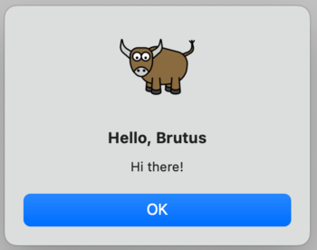
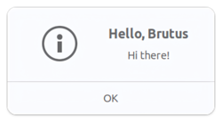

# Tutorial 4 - Updating your application

In the last tutorial, we packaged our application as a native
application. If you're dealing with a real-world app, that isn't going
to be the end of the story - you'll likely do some testing, discover
problems, and need to make some changes. Even if your application is
perfect, you'll eventually want to publish version 2 of your application
with improvements.

So - how do you update your installed app when you make code changes?

## Updating application code

Our application currently prints to the console when you press the
button. However, GUI applications shouldn't really use the console for
output. They need to use dialogs to communicate with users.

Let's add a dialog box to say hello, instead of writing to the console.
Modify the `say_hello` callback so it looks like this:

```python
async def say_hello(self, widget):
    await self.main_window.dialog(
        toga.InfoDialog(
            f"Hello, {self.name_input.value}",
            "Hi there!",
        )
    )
```

We need to make the method `async` so that when we display the dialog,
the rest of the application continues to run. Don't worry about this
detail too much right now - we'll give a more detailed explanation in
[Tutorial 8](tutorial-8.md).

This directs Toga to open a modal dialog box when the button is pressed.

If you run `briefcase dev`, enter a name, and press the button, you'll
see the new dialog box:

/// tab | macOS



/// caption

///

///

/// tab | Linux



/// caption

///

///

/// tab | Windows


/// caption

///

///

However, if you run `briefcase run`, the dialog box won't appear.

Why is this? Well, `briefcase dev` operates by running your code in
place - it tries to produce as realistic runtime environment for your
code as possible, but it doesn't provide or use any of the platform
infrastructure for wrapping your code as an application. Part of the
process of packaging your app involves copying your code *into* the
application bundle - and at the moment, your application still has the
old code in it.

So - we need to tell briefcase to update your app, copying in the new
version of the code. We *could* do this by deleting the old platform
directory and starting from scratch. However, Briefcase provides an
easier way - you can update the code for your existing bundled
application:

/// tab | macOS

```console
(beeware-venv) $ briefcase update

[helloworld] Updating application code...
Installing src/helloworld... done

[helloworld] Removing unneeded app content...
Removing unneeded app bundle content... done

[helloworld] Application updated.
```

///

/// tab | Linux

```console
(beeware-venv) $ briefcase update

[helloworld] Finalizing application configuration...
Targeting ubuntu:jammy (Vendor base debian)
Determining glibc version... done
Targeting glibc 2.35
Targeting Python3.10

[helloworld] Updating application code...
Installing src/helloworld... done

[helloworld] Removing unneeded app content...
Removing unneeded app bundle content... done


[helloworld] Application updated.
```

///

/// tab | Windows

```doscon
(beeware-venv) C:\...>briefcase update

[helloworld] Updating application code...
Installing src/helloworld... done

[helloworld] Removing unneeded app content...
Removing unneeded app bundle content... done

[helloworld] Application updated.
```

///

If Briefcase can't find the scaffolded template, it will automatically
invoke `create` to generate a fresh scaffold.

Now that we've updated the installer code, we can then run
`briefcase build` to re-compile the app, `briefcase run` to run the
updated app, and `briefcase package` to repackage the application for
distribution.

/// note | Note

macOS users, remember that as noted in [Tutorial 3](tutorial-3.md), for the
tutorial we recommend running `briefcase package` with the
`--adhoc-sign` flag to avoid the complexity of setting up a code signing
identity and keep the tutorial as simple as possible.

///

## Update and run in one step

If you're rapidly iterating code changes, you'll likely want to make a
code change, update the application, and immediately re-run your
application. For most purposes, developer mode (`briefcase dev`) will be
the easiest way to do this sort of rapid iteration; however, if you're
testing something about how your application runs as a native binary, or
hunting a bug that only manifests when your application is in packaged
form, you may need to use repeated calls to `briefcase run`. To simplify
the process of updating and running the bundled app, Briefcase has a
shortcut to support this usage pattern - the `-u` (or `--update`) option
on the `run` command.

Let's try making another change. You may have noticed that if you don't
type a name in the text input box, the dialog will say "Hello, ". Let's
modify the `say_hello` function again to handle this edge case.

At the top of the file, between the imports and the `class HelloWorld`
definition, add a utility method to generate an appropriate greeting
depending on the value of the name that has been provided:

```python
def greeting(name):
    if name:
        return f"Hello, {name}"
    else:
        return "Hello, stranger"
```

Then, modify the `say_hello` callback to use this new utility method:

```python
async def say_hello(self, widget):
    await self.main_window.dialog(
        toga.InfoDialog(
            greeting(self.name_input.value),
            "Hi there!",
        )
    )
```

Run your app in development mode (with `briefcase dev`) to confirm that
the new logic works; then update, build and run the app with one
command:

/// tab | macOS

```console
(beeware-venv) $ briefcase run -u

[helloworld] Updating application code...
Installing src/helloworld... done

[helloworld] Removing unneeded app content...
Removing unneeded app bundle content... done

[helloworld] Application updated.

[helloworld] Building application...
...

[helloworld] Built build/helloworld/macos/app/Hello World.app

[helloworld] Starting app...
```

///

/// tab | Linux

```console
(beeware-venv) $ briefcase run -u

[helloworld] Finalizing application configuration...
Targeting ubuntu:jammy (Vendor base debian)
Determining glibc version... done
Targeting glibc 2.35
Targeting Python3.10

[helloworld] Updating application code...
Installing src/helloworld... done

[helloworld] Removing unneeded app content...
Removing unneeded app bundle content... done

[helloworld] Application updated.

[helloworld] Building application...
...

[helloworld] Built build/helloworld/linux/ubuntu/jammy/helloworld-0.0.1/usr/bin/helloworld

[helloworld] Starting app...
```

///

/// tab | Windows

```doscon
(beeware-venv) C:\...>briefcase run -u

[helloworld] Updating application code...
Installing src/helloworld... done

[helloworld] Removing unneeded app content...
Removing unneeded app bundle content... done

[helloworld] Application updated.

[helloworld] Starting app...
```

///

The package command also accepts the `-u` argument, so if you make a
change to your application code and want to repackage immediately, you
can run `briefcase package -u`.

## Next steps

We now have our application packaged for distribution on desktop
platforms, and we've been able to update the code in our application.

But what about mobile? In [Tutorial 5](tutorial-5/index.md), we'll
convert our application into a mobile application, and deploy it onto a
device simulator, and onto a phone.
