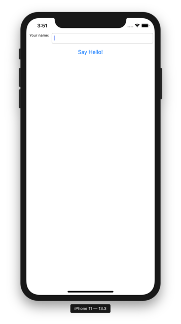

# Tutorial 5 - Taking it mobile: iOS

To compile iOS applications we'll need Xcode, which is available for free from [the macOS App Store](https://apps.apple.com/au/app/xcode/id497799835?mt=12). Once Xcode is installed, launch it from Applications and accept the Xcode License Agreement. Next, Xcode will show which components are built-in, and which components you may download. Select the checkbox next to iOS (followed by the current version number), and then click "Download and Install" to install it. Xcode will install the system components, followed by the iOS Simulator.

Once we've got Xcode and the iOS simulator installed, we can take our application and deploy it as an iOS app.

The process of deploying an application to iOS is very similar to the process for deploying as a desktop application. First, you run the `create` command - but this time, we specify that we want to create an iOS application:

```console
(beeware-venv) $ briefcase create iOS

[helloworld] Generating application template...
Using app template: https://github.com/beeware/briefcase-iOS-Xcode-template.git, branch v0.3.18
...

[helloworld] Installing support package...
...

[helloworld] Installing application code...
Installing src/helloworld... done

[helloworld] Installing requirements...
...

[helloworld] Installing application resources...
...

[helloworld] Removing unneeded app content...
...

[helloworld] Created build/helloworld/ios/xcode
```

Once this completes, we'll have a `build/helloworld/ios/xcode` directory containing an Xcode project, as well as the support libraries and the application code needed for the application.

You can then use Briefcase to compile your app using `briefcase build iOS`:

```console
(beeware-venv) $ briefcase build iOS

[helloworld] Updating app metadata...
Setting main module... done

[helloworld] Building Xcode project...
...
Building... done

[helloworld] Built build/helloworld/ios/xcode/build/Debug-iphonesimulator/Hello World.app
```

We're now ready to run our application, using `briefcase run iOS`. You'll be prompted to select a device to compile for; if you've got simulators for multiple iOS SDK versions installed, you may also be asked which iOS version you want to target. The options you are shown may differ from the options show in this output - at the very least, the list of devices will likely be different. For our purposes, it doesn't matter which simulator you pick.

```console
(beeware-venv) $ briefcase run iOS

Select simulator device:

   1) iPad (10th generation)
   2) iPad Air (5th generation)
   3) iPad Pro (11-inch) (4th generation)
   4) iPad Pro (12.9-inch) (6th generation)
   5) iPad mini (6th generation)
   6) iPhone 14
   7) iPhone 14 Plus
   8) iPhone 14 Pro
   9) iPhone 14 Pro Max
   10) iPhone SE (3rd generation)

>  10

In the future, you could specify this device by running:

    $ briefcase run iOS -d "iPhone SE (3rd generation)::iOS 16.2"

or:

    $ briefcase run iOS -d 2614A2DD-574F-4C1F-9F1E-478F32DE282E

[helloworld] Starting app on an iPhone SE (3rd generation) running iOS 16.2 (device UDID 2614A2DD-574F-4C1F-9F1E-478F32DE282E)
Booting simulator... done
Opening simulator... done

[helloworld] Installing app...
Uninstalling any existing app version... done
Installing new app version... done

[helloworld] Starting app...
Launching app... done

[helloworld] Following simulator log output (type CTRL-C to stop log)...
===========================================================================
...
```

This will start the iOS simulator, install your app, and start it. You should see the simulator start, and eventually open your iOS application:



/// caption

///

While the app is running, you'll see a series of Simulator log output messages in the console. Typing Ctrl+C into the terminal will halt the messages in the console, but it will not close the simulator. This is so you can test new changes without restarting the simulator.

If you know ahead of time which iOS simulator you want to target, you can tell Briefcase to use that simulator by providing a `-d` (or `--device`) option. Using the name of the device you selected when you built your application, run:

```console
$ briefcase run iOS -d "iPhone SE (3rd generation)"
```

If you have multiple iOS versions available, Briefcase will pick the highest iOS version; if you want to pick a particular iOS version, you tell it to use that specific version:

```console
$ briefcase run iOS -d "iPhone SE (3rd generation)::iOS 15.5"
```

Or, you can name a specific device UDID:

```console
$ briefcase run iOS -d 2614A2DD-574F-4C1F-9F1E-478F32DE282E
```

## Next steps

We've now got an application on our phone! Is there anywhere else we can deploy a BeeWare app? Turn to [Tutorial 6](../tutorial-6.md) to find out...
