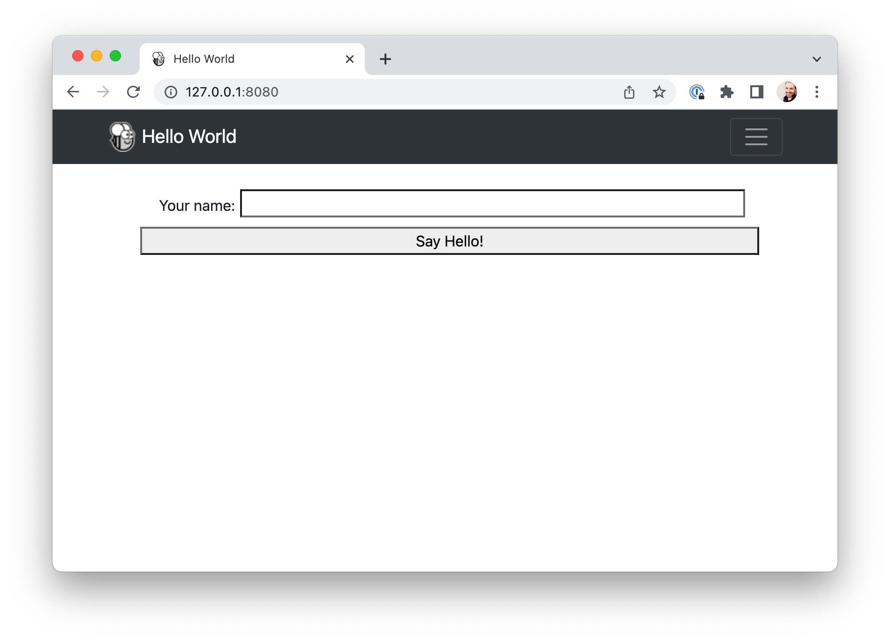

# Tutorial 6 - Put it on the web!  { #tutorial-6 }

In addition to supporting mobile platforms, the Toga widget toolkit also
supports the web! Using the same API that you used to deploy your
desktop and mobile applications, you can deploy your application as a
single-page web app.

::: {.admonition}
Proof of Concept

The Toga Web backend is the least mature of all the Toga backends. It's
mature enough to show off a few features, but it's likely to be buggy,
and will be missing many of the widgets that are available on other
platforms. At this point in time, Web deployment should be considered a
"Proof of Concept" - enough to demonstrate what can be done, but not
enough to be relied on for serious development.

If you have problems with this step of the tutorial, you can skip to the
next page.
:::

## Deploying as a web app

The process of deploying as a single-page web app follows the same
familiar pattern - you create the application, then build the
application, then run it. However, Briefcase can be a little bit smart;
if you attempt to run an application, and Briefcase determines that it
hasn't been created or built for the platform being targeted, it will do
the create and build steps for you. Since this is our first time running
the app for the web, we can perform all three steps with one command:

:::::: {.tabs}
::: {.group-tab}
macOS

``` console
(beeware-venv) $ briefcase run web

[helloworld] Generating application template...
Using app template: https://github.com/beeware/briefcase-web-static-template.git, branch v0.3.18
...

[helloworld] Installing support package...
No support package required.

[helloworld] Installing application code...
Installing src/helloworld... done

[helloworld] Installing requirements...
Writing requirements file... done

[helloworld] Installing application resources...
...

[helloworld] Removing unneeded app content...
Removing unneeded app bundle content... done

[helloworld] Created build/helloworld/web/static

[helloworld] Building web project...
...

[helloworld] Built build/helloworld/web/static/www/index.html

[helloworld] Starting web server...
Web server open on http://127.0.0.1:8080

[helloworld] Web server log output (type CTRL-C to stop log)...
===========================================================================
```
:::

::: {.group-tab}
Linux

``` console
(beeware-venv) $ briefcase run web

[helloworld] Generating application template...
Using app template: https://github.com/beeware/briefcase-web-static-template.git, branch v0.3.18
...

[helloworld] Installing support package...
No support package required.

[helloworld] Installing application code...
Installing src/helloworld... done

[helloworld] Installing requirements...
Writing requirements file... done

[helloworld] Installing application resources...
...

[helloworld] Removing unneeded app content...
Removing unneeded app bundle content... done

[helloworld] Created build/helloworld/web/static

[helloworld] Building web project...
...

[helloworld] Built build/helloworld/web/static/www/index.html

[helloworld] Starting web server...
Web server open on http://127.0.0.1:8080

[helloworld] Web server log output (type CTRL-C to stop log)...
===========================================================================
```
:::

::: {.group-tab}
Windows

``` doscon
(beeware-venv) C:\...>briefcase run web

[helloworld] Generating application template...
Using app template: https://github.com/beeware/briefcase-web-static-template.git, branch v0.3.18
...

[helloworld] Installing support package...
No support package required.

[helloworld] Installing application code...
Installing src/helloworld... done

[helloworld] Installing requirements...
Writing requirements file... done

[helloworld] Installing application resources...
...

[helloworld] Removing unneeded app content...
Removing unneeded app bundle content... done

[helloworld] Created build\helloworld\web\static

[helloworld] Building web project...
...

[helloworld] Built build\helloworld\web\static\www\index.html

[helloworld] Starting web server...
Web server open on http://127.0.0.1:8080

[helloworld] Web server log output (type CTRL-C to stop log)...
===========================================================================
```
:::
::::::

This will open a web browser, pointing at <http://127.0.0.1:8080>:



If you enter your name and click the button, a dialog will appear.

## How does this work?

This web app is a static website - a single HTML source page, with some
CSS and other resources. Briefcase has started a local web server to
serve this page so your browser can view the page. If you wanted to put
this web page into production, you could copy the contents of the `www`
folder onto any web server that can serve static content.

But when you press the button, you're running Python code... how does
that work? Toga uses [PyScript](https://pyscript.net) to provide a
Python interpreter in the browser. Briefcase packages your app's code as
wheels that PyScript can load in the browser. When the page is loaded,
the application code runs in the browser, building the UI using the
browser DOM. When you click a button, that button runs the event
handling code in the browser.

## Next steps

Although we've now deployed this app on desktop, mobile and the web, the
app is fairly simple, and doesn't involve any third-party libraries. Can
we include libraries from the Python Package Index (PyPI) in our app?
Turn to `Tutorial 7 <tutorial-7>`{.interpreted-text role="doc"} to find
out...
